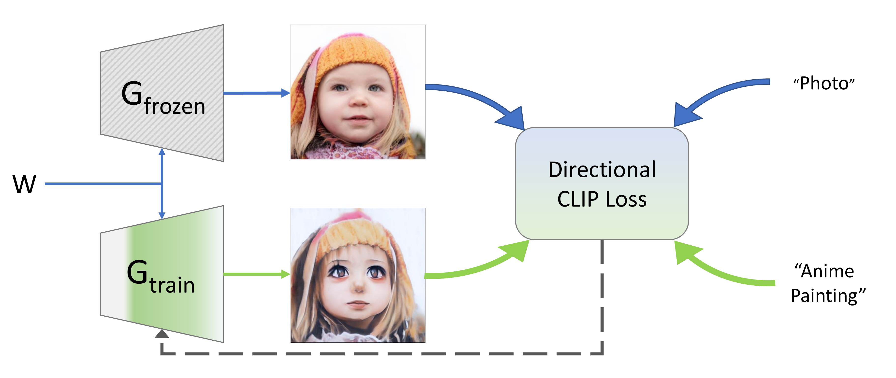
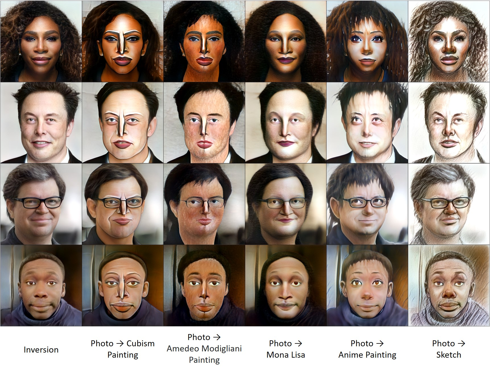
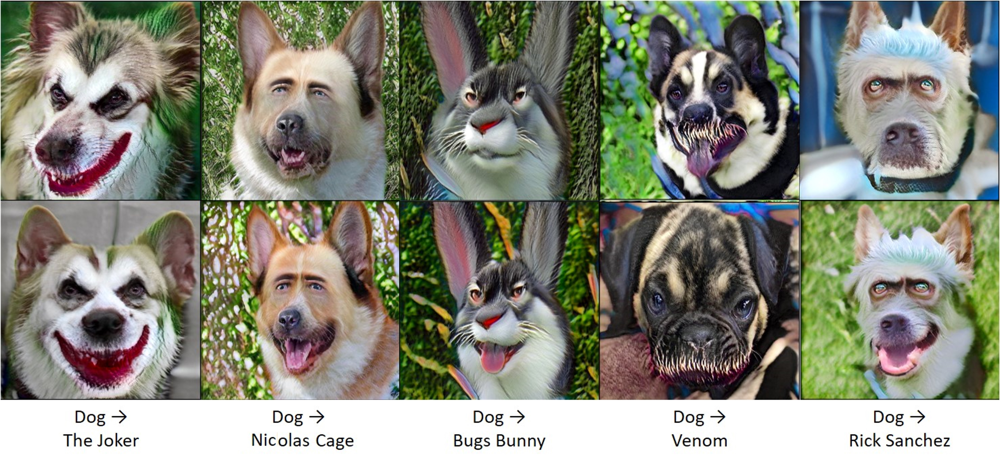

# StyleGAN-NADA: CLIP-Guided Domain Adaptation of Image Generators

[](http://colab.research.google.com/github/rinongal/stylegan-nada/blob/main/stylegan_nada.ipynb) [](https://arxiv.org/abs/2108.00946)

[[Project Website](https://stylegan-nada.github.io/)]

> **StyleGAN-NADA: CLIP-Guided Domain Adaptation of Image Generators**<br>
> Rinon Gal, Or Patashnik, Haggai Maron, Gal Chechik, Daniel Cohen-Or <br>

>**Abstract**: <br>
> Can a generative model be trained to produce images from a specific domain, guided by a text prompt only, without seeing any image? In other words: can an image generator be trained blindly? Leveraging the semantic power of large scale Contrastive-Language-Image-Pre-training (CLIP) models, we present a text-driven method that allows shifting a generative model to new domains, without having to collect even a single image from those domains.
We show that through natural language prompts and a few minutes of training, our method can adapt a generator across a multitude of domains characterized by diverse styles and shapes. Notably, many of these modifications would be difficult or outright impossible to reach with existing methods.
We conduct an extensive set of experiments and comparisons across a wide range of domains. These demonstrate the effectiveness of our approach and show that our shifted models maintain the latent-space properties that make generative models appealing for downstream tasks.

## Description
This repo contains the official implementation of StyleGAN-NADA, a Non-Adversarial Domain Adaptation for image generators.
At a high level, our method works using two paired generators. We initialize both using a pre-trained model (for example, FFHQ). We hold one generator constant and train the other by demanding that the direction between their generated images in clip space aligns with some given textual direction.

The following diagram illustrates the process:



We set up a colab notebook so you can play with it yourself :) Let us know if you come up with any cool results!

We've also included inversion in the notebook (using [ReStyle](https://github.com/yuval-alaluf/restyle-encoder)) so you can use the paired generators to edit real images.
Most edits will work well with the [pSp](https://github.com/eladrich/pixel2style2pixel) version of ReStyle, which also allows for more accurate reconstructions.
In some cases, you may need to switch to the [e4e](https://github.com/omertov/encoder4editing) based encoder for better editing at the cost of reconstruction accuracy.

## Generator Domain Adaptation

We provide many examples of converted generators in our [project page](https://stylegan-nada.github.io/). Here are a few samples:

<p float="centered">
  
  
  
   
</p>

## Setup

The code relies on the official implementation of [CLIP](https://github.com/openai/CLIP), 
and the [Rosinality](https://github.com/rosinality/stylegan2-pytorch/) pytorch implementation of StyleGAN2.

### Requirements
- Anaconda
- Pretrained StyleGAN2 generator (can be downloaded from [here](https://drive.google.com/file/d/1EM87UquaoQmk17Q8d5kYIAHqu0dkYqdT/view?usp=sharing)). You can also download a model from [here](https://github.com/NVlabs/stylegan2-ada) and convert it with the provited script. See the colab notebook for examples.

In addition, run the following commands:
  ```shell script
conda install --yes -c pytorch pytorch=1.7.1 torchvision cudatoolkit=<CUDA_VERSION>
pip install ftfy regex tqdm
pip install git+https://github.com/openai/CLIP.git
```

### Usage

To convert a generator from one domain to another, use the colab notebook or run the training script in the ZSSGAN directory:

```
python train.py --size 1024 
                --batch 2 
                --n_sample 4 
                --output_dir /path/to/output/dir 
                --lr 0.002 
                --frozen_gen_ckpt /path/to/stylegan2-ffhq-config-f.pt 
                --iter 301 
                --source_class "photo" 
                --target_class "sketch" 
                --auto_layer_k 18
                --auto_layer_iters 1 
                --auto_layer_batch 8 
                --output_interval 50 
                --clip_models "ViT-B/32" "ViT-B/16" 
                --clip_model_weights 1.0 1.0 
                --mixing 0.0
                --save_interval 150
```

Where you should adjust size to match the size of the pre-trained model, and the source_class and target_class descriptions control the direction of change.
For an explenation of each argument (and a few additional options), please consult ZSSGAN/options/train_options.py. For most modifications these default parameters should be good enough. See the colab notebook for more detailed directions.

Additionally, we are planning on releasing a dockerized version of our model in the coming days, including a simple training UI. 

## Related Works

The concept of using CLIP to guide StyleGAN generation results was introduced in [StyleCLIP](https://arxiv.org/abs/2103.17249) (Patashnik et al.).

We invert real images into the GAN's latent space using [ReStyle](https://arxiv.org/abs/2104.02699) (Alaluf et al.)

## Citation

If you make use of our work, please cite our paper:

```
@misc{gal2021stylegannada,
      title={StyleGAN-NADA: CLIP-Guided Domain Adaptation of Image Generators}, 
      author={Rinon Gal and Or Patashnik and Haggai Maron and Gal Chechik and Daniel Cohen-Or},
      year={2021},
      eprint={2108.00946},
      archivePrefix={arXiv},
      primaryClass={cs.CV}
}
```

## Additional examples:

Our method can be used to enable out-of-domain editing of real images, using pre-trained, off-the-shelf inversion networks. Here are a few more examples:





